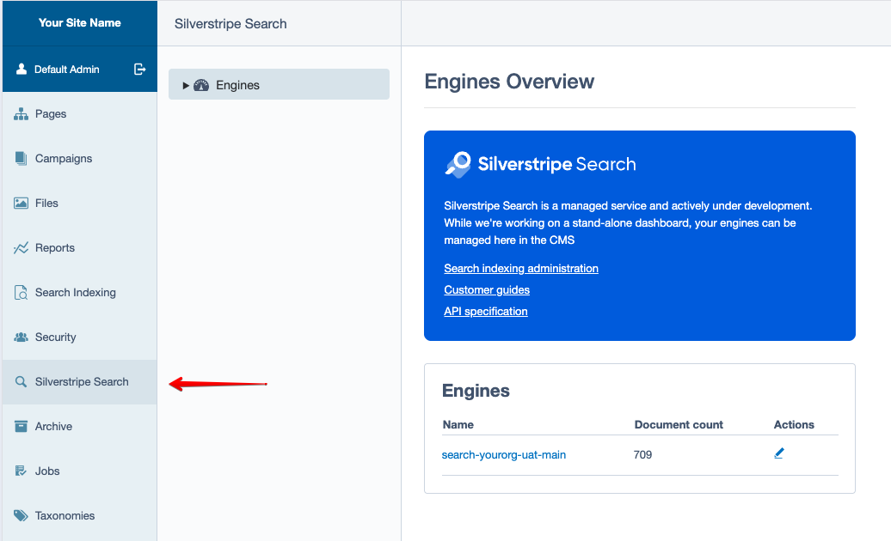
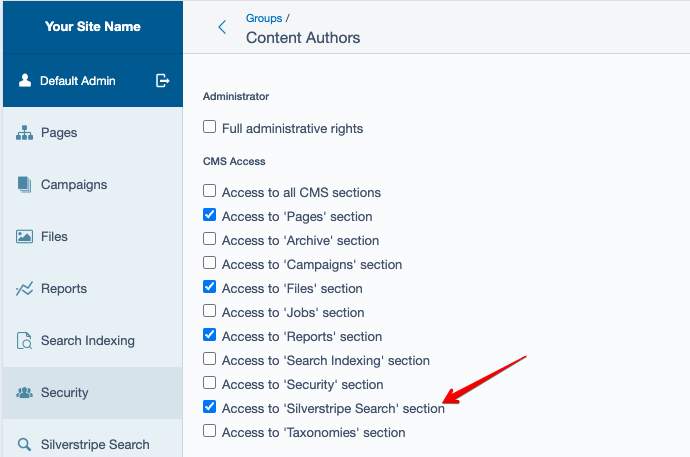
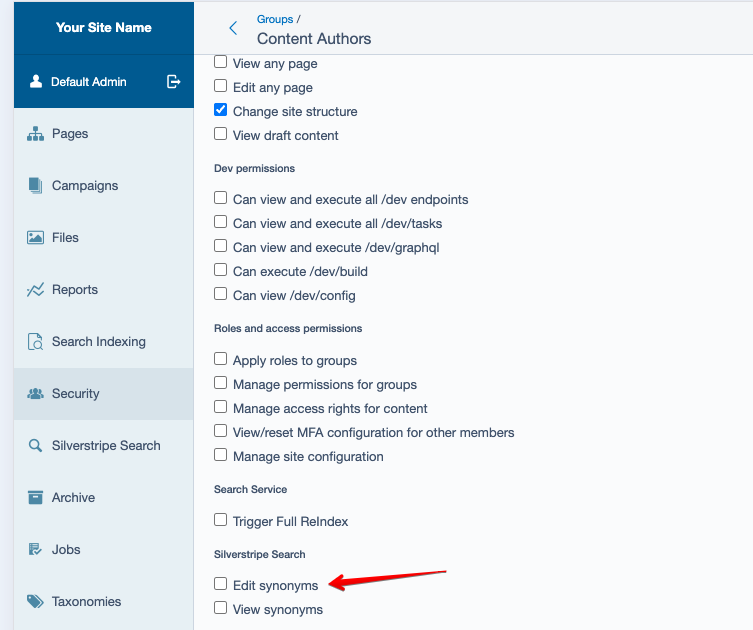

<picture style="background-color: #005ae0; color: white; border-radius: 8px; flex-direction: column; align-items: start; gap: 1.6rem; padding: 1.8rem; display: flex;">
    
    <h1>Administration module</h1>
</picture>

The Silverstripe Search Administration module provides an interface for configuring your search settings from within the Silverstripe CMS.

## Installation


```sh
composer require silverstripeltd/silverstripe-bifrost-admin
```

This module requires the **Forager Module** is set up and configured first so refer to [the SDK documentation](https://github.com/silverstripeltd/silverstripe-search-sdk) for how to set that up.

After installation the admin section is available in the CMS Sidebar:



Also note that the "Search Service" menu item will also be renamed "Search Indexing" to avoid confusion between these modules. 

## Permissions

The module comes with permissions so that you can control who can access the Search Service Administration area and perform administrative actions. You will need to assign these to the non-admin users you wish to be able to access it. Head to the Security section (`/admin/security`) in the CMS to do this.



Currently only Synonyms are supported:


## More information

You can get more information on the Search Service and its features in the [Service Documentation](https://search.silverstripe.cloud/resources/guides/index.html)
